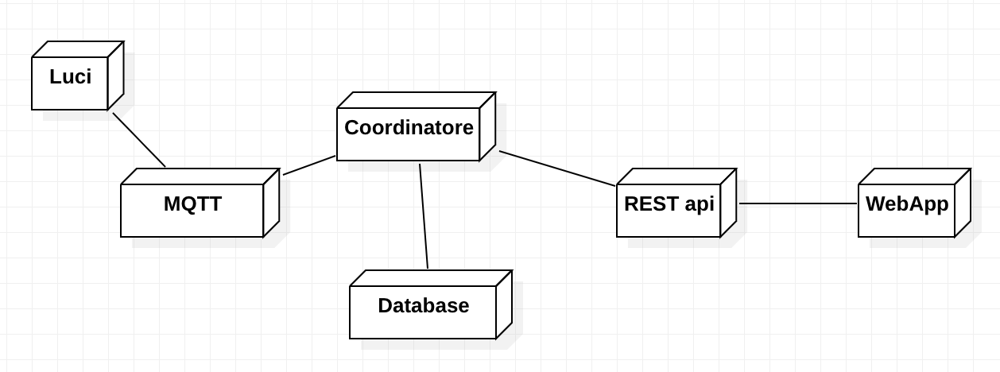

# Piano di svolgimento

In linea di massima le ore produttive che potremo utilizzare saranno 95 a testa. Tutte queste ore ammoneranno almeno a §12000. Andiamo quindi ad analizzare le richieste e a stendere una massima relativamente al costo totale di progetto. Anche tenendo conto della tabella relativa ai ruoli.

# Obiettivi

L’obiettivo è sviluppare un’applicazione **web responsive** in grado di monitorare e di eseguire le azioni sotto menzionate sul sistema di illuminazione pubblico.

## Assunti preventivi

- il gestore è in possesso di uno smartphone (Android o iOS) e nelle condizioni di utilizzare un browser web.

## Obiettivi obbligatori

- **Rilevamento della presenza di persone** in prossimità della fonte luminosa: attraverso sensori eterogenei (bluetooth, IR, videocamere, ecc.) il sistema rileva la presenza di persone in un’area della città gestita dal sistema e attiva le luci di conseguenza.

- Aumento/riduzione dell’intensità luminosa: il sistema deve essere in grado di comunicare attraverso un protocollo IoT l’aumento o la riduzione dell’intensità luminosa emessa da uno specifico impianto di illuminazione, permettendo una regolazione singola o per l’intera via/piazza (area coperta dal servizio).

- Rilevamento automatico del guasto di un impianto di illuminazione: il sistema deve rilevare ogni eventuale malfunzionamento dell’impianto di illuminazione, notificando il gestore ed aprendo un ticket di assistenza su una piattaforma esterna che permetta di identificare la località del guasto.

- Segnalazione manuale del guasto di un impianto di illuminazione: il sistema deve permettere di inserire manualmente un nuovo guasto ad un impianto di illuminazione.

- Aumento/riduzione manuale dell’intensità luminosa: il sistema deve permette al gestore di aumentare/ridurre o riportare in modalità automatica l’illuminazione di un singolo impianto luminoso o di un’intera area coperta dal servizio.

- Inserimento e gestione di un impianto luminoso: il sistema deve permettere al gestore
l’inserimento di nuovi impianti luminosi e il loro inserimento o rimozione all’interno di un’area coperta dal servizio.

- Aumento o riduzione globale dell’intensità luminosa: il sistema deve permettere al gestore l’aumento o la riduzione globale (su tutti gli impianti controllati dell’intensità luminosa, opzione particolarmente utile in condizioni di crepuscolo o luce lunare particolarmente intensa.

## Obiettivi secondari

- modulare la luminosità a seconda della quantità di persone o tipologia di entità;

- Rilevamento tipologia guasti (Guasti locali o distribuiti, guasti a sistemi di alimentazione);

- Preset di illuminazione per le varie situazioni

- integrazione con previsioni di eventi normali(alba e tramonto) ed anomali come eclissi;

- Gestione multi utente ("gestore illuminazione pubblica", "installatore/manutentore", "Verificatore d'impianto" , altro)

- Pagina disponibile ai "cittadini" dove questi possano (seguendo 2/3 passaggi, ad esempio caricando un'immagine del guasto) caricare una segnalazione di guasto.

## Ottica di espansione futura
- Integrazioni future con sistemi di alimentazione/UPS vari nella gestione guasti/distribuzione dell'alimentazione;

- Api pubblica regolamentata utilizzabile in futuro da pannellistica a led per mostrare ai cittadini i risparmi o altro.

# Prima stesura architetturale

Visto l'**ambito critico** di operazione del prodotto software per noi i capostipiti nello sviluppo di questo progetto saranno: **alta modularità, alta scalabilità, alta resilienza e facile estensibilità** dello stesso.

L'architettura seguirà quindi i principi base di un sistema a microservizi che tenga conto di tutte queste importanti questioni.

## User stories / casi d'uso

1. login e logout di un operatore
2. collegamento di un impianto luminoso ai dati derivanti da un sensore (modalità automatica)
3. gestione manuale di un impianto luminoso
4. aumento o riduzione globale dell’intensità luminosa da parte di un operatore o tramite dati di un
sensore
5. aumento o riduzione locale (per area illuminata) dell’intensità luminosa da parte di un operatore o tramite dati di un sensore
6. Gestione ticketing guasti
7. inserimento e gestione di un impianto luminoso
8. creazione, modifica e rimozione di nuove aree illuminate
9. tracciamento delle intensità luminose di ogni impianto.
10. Rilevamento della presenza in un’area illuminata e aumento automatico dell’intensità
luminosa

## Utenti

Molteplici saranno gli utenti che utilizzeranno il sistema.

|Utente| utilizzi | Tipo di requisito|
|---|---|---|
|Semplice cittadino|Può vedere una dashboard relativa all'illuminazione| Aggiuntivo|
|Gestore dell'illuminazione| Può impostare l'illuminazione| Obbligatorio|
|Gestore momentaneo| Può impostare l'illuminazione per un periodo limitato di tempo|Aggiuntivo |
|Installatore/manutentore|Aggiunge nuove sezioni illuminanti, risolve i guasti|Obbligatorio|
|Verificatore di impianto|Gira a controllare periodicamente se ci sono guasti ai corpi illuminanti| Obbligatorio|

## Servizi

|Servizio|Scopo|Tecnologia|
|---|---|---|
|Mqtt|Comunicazione delle componenti IoT |Mosquitto|
|Database|Stoccaggio a lungo termine dei dati per un'analisi futura degli stessi per prevenire guasti o risolvere situazioni ricorrenti| Postgres|
|Coordinatore|Coordinamento e gestione diretta degli apparati illuminanti| Python|
|ApiREST del sistema d'illuminazione|Api Backend per la webapp e altri utilizzi futuri|Python, Flask|
|Backend/Api Ticketing|Gestisce il sistema di ticketing dei guasti|Python, Flask|
|WebApp|Consente agli utenti(Definiti più avanti) di interfacciarsi con il sistema|VueJs o React|

## Gestione di Deploy

Per il deploy sarà utilizzato **Docker** per consentire, alla bisogna, lo scalare orizzontale del sistema, così da poter gestire più utenti abbattendo i costi.

Il sistema sarà _multi-tennant_ as a service oppure installabile _on premise_.

# Testing

Ognuno dei servizi avrà la sua specifica strategia di testing.

I test di ognuno dovranno avere comunque almeno l'80% di code coverage e dovranno essere correlati di report relativamente all'esecuzione degli stessi.
